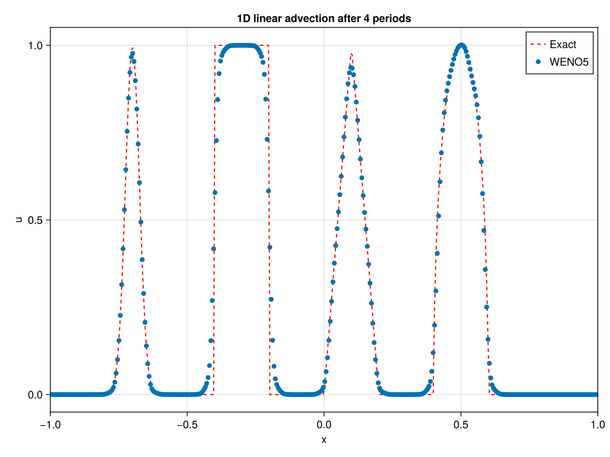

## Getting Started

There are currently two exported functions in FiniteDiffWENO5.jl: `WENOScheme()` and `WENO_step!()`. The user must define the grid and the initial conditions themselves.

`WENOScheme()` is used to create a WENO scheme structure containing all the necessary information for the WENO method, while `WENO_step!()` performs one step of the time integration using the WENO-Z method and a 3rd-order Runge-Kutta method. Refer to the docstrings to see the available options for each function.

Here is a simple example of how to use FiniteDiffWENO5.jl to solve the 1D advection equation using the conservative form on a staggered grid. For more examples, please refer to the folder examples in the repository or the tests in the test folder.

```julia
using FiniteDiffWENO5

nx = 400

x_min = -1.0
x_max = 1.0
Lx = x_max - x_min

x = range(x_min, stop = x_max, length = nx)

# Courant number
CFL = 0.4
period = 4

# Parameters for Shu test
z = -0.7
δ = 0.005
β = log(2) / (36 * δ^2)
a = 0.5
α = 10

# Functions
G(x, β, z) = exp.(-β .* (x .- z) .^ 2)
F(x, α, a) = sqrt.(max.(1 .- α^2 .* (x .- a) .^ 2, 0.0))

# Grid x assumed defined
u0_vec = zeros(length(x))

# Gaussian-like smooth bump at x in [-0.8, -0.6]
idx = (x .>= -0.8) .& (x .<= -0.6)
u0_vec[idx] .= (1 / 6) .* (G(x[idx], β, z - δ) .+ 4 .* G(x[idx], β, z) .+ G(x[idx], β, z + δ))

# Heaviside step at x in [-0.4, -0.2]
idx = (x .>= -0.4) .& (x .<= -0.2)
u0_vec[idx] .= 1.0

# Piecewise linear ramp at x in [0, 0.2]
# Triangular spike at x=0.1, base width 0.2
idx = abs.(x .- 0.1) .<= 0.1
u0_vec[idx] .= 1 .- 10 .* abs.(x[idx] .- 0.1)

# Elliptic/smooth bell at x in [0.4, 0.6]
idx = (x .>= 0.4) .& (x .<= 0.6)
u0_vec[idx] .= (1 / 6) .* (F(x[idx], α, a - δ) .+ 4 .* F(x[idx], α, a) .+ F(x[idx], α, a + δ))


u = copy(u0_vec)

# fix here boundary to periodic when equal to 2
# staggering = true means that the advection velocity is defined on the sides of the cells and should be of size nx+1 compared to the scalar field u.
# Multithreading to false means that the computations will be done on a single thread.
# Set to true to enable multithreading if the Julia session was started with multiple threads (e.g. `julia -t 4`).
weno = WENOScheme(u; boundary = (2, 2), stag = true, multithreading = false)

# advection velocity with size nx+1 for staggered grid (here constant)
a = (; x = ones(nx + 1))

# grid size
Δx = x[2] - x[1]
Δt = CFL * Δx^(5 / 3)

tmax = period * (Lx + Δx) / maximum(abs.(a.x))

t = 0

while t < tmax
    # take as input the scalar field u, the advection velocity a as a NamedTuple,
    # the WENO scheme struct weno, the time step Δt and the grid size Δx
    WENO_step!(u, a, weno, Δt, Δx)

    t += Δt

    if t + Δt > tmax
        Δt = tmax - t
    end
end

f = Figure(size = (800, 600), dpi = 400)
ax = Axis(f[1, 1], title = "1D linear advection after $period periods", xlabel = "x", ylabel = "u")
lines!(ax, x, u0_vec, label = "Exact", linestyle = :dash, color = :red)
scatter!(ax, x, u, label = "WENO5")
xlims!(ax, x_min, x_max)
axislegend(ax)
display(f)
```

which outputs:

